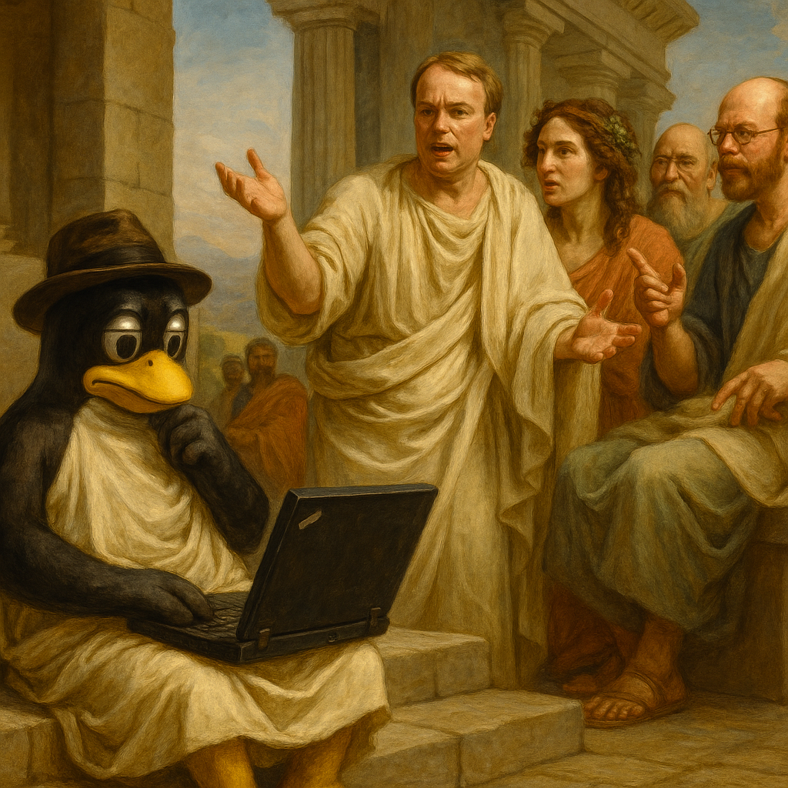
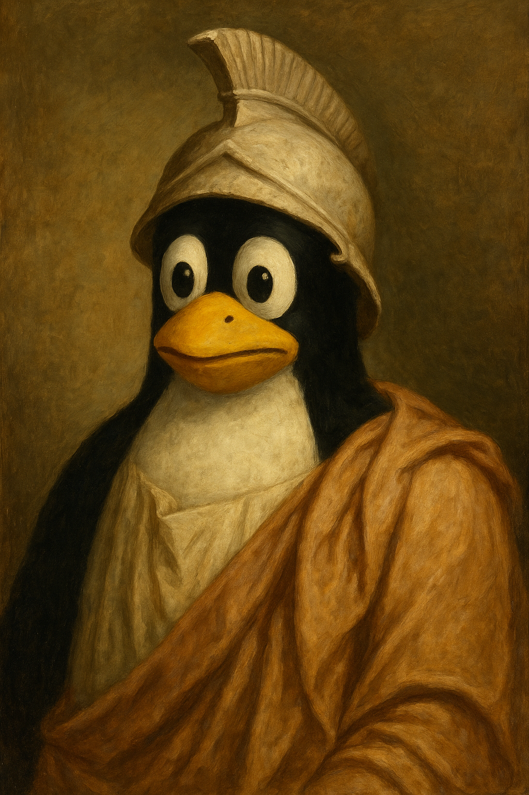
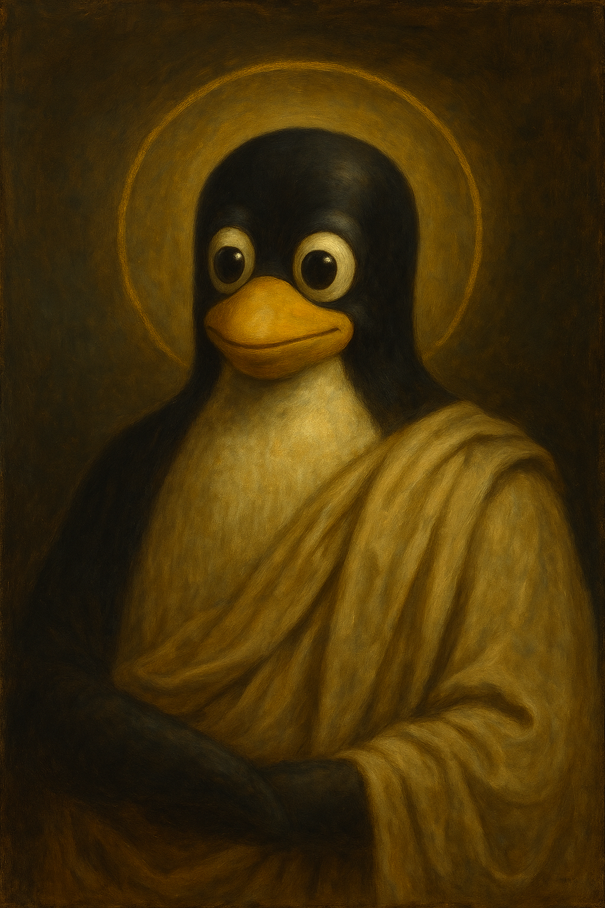

# 🐧 The GitScrolls 📜

_Sacred wisdom for the journey from first commit to final teaching_




---

## __🎯 What Are The GitScrolls?__

The __GitScrolls__ are ten sacred teachings that trace the archetypal journey every developer takes—from innocent beginner who commits "fix stuff" to wise mentor who helps others navigate the beautiful complexity of software development.

Born from the recognition that __software development is fundamentally about humans helping humans through code__, the GitScrolls wrap genuine technical wisdom in mythology that makes profound truths accessible, memorable, and kind.

> _"In the beginning was the commit, and the commit was with Tux, and the commit was good."_

__🚀 [Quick-Start Guide](guides/quick-start-guide.md)__ - _Get oriented in 5 minutes_  
__📖 [Browse Scrolls](scrolls/)__ - _The complete teachings_  
__🤝 [Join Community](https://github.com/gitscrolls/gitscrolls/discussions)__ - _Connect with others_

---

### __🎭 The Aspects of Tux__

The GitScrolls follow the archetypal transformation of every developer through five classical phases…

| Portrait | Name              | Inspiration      | IPA Pronunciation | Phonetic         | Archetype Description               |
|----------|-------------------|------------------|--------------------|------------------|-------------------------------------|
|  | __Tuxicles__      | Pericles         | [/ˈtʌks.ɪ.kliːz/](https://ipa-reader.com/?text=%CB%88t%CA%8Cks.%C9%AA.kli%CB%90z) | _"TUHKS-ih-kleez"_     | The Innocent–commits without thinking |
|  | __Tuxrates__      | Socrates         | [/ˈtʌks.rə.tiːz/](https://ipa-reader.com/?text=%CB%88t%CA%8Cks.r%C9%99.ti%CB%90z) | _"TUHKS-rah-teez"_     | The Questioner–asks "why" about everything |
|  | __Tuxilles the Battle-Scarred__ | Odysseus | [/tʌksˈɪl.iːz/](https://ipa-reader.com/?text=t%CA%8Cks%CB%88%C9%AAl.i%CB%90z) | _"tuhks-ILL-eez"_ | The Exile–learns wisdom through consequence |
|  | __Tuxilles the Teacher__ | Mentor/Athena | [/tʌksˈɪl.iːz/](https://ipa-reader.com/?text=t%CA%8Cks%CB%88%C9%AAl.i%CB%90z) | _"tuhks-ILL-eez"_ | The Guide–nurtures others with patience |
|  | __Tux Transcendent__ | The Eternal Cycle | [/tʌks trænˈsɛn.dənt/](https://ipa-reader.com/?text=t%CA%8Cks%20tr%C3%A6n%CB%88s%C9%9Bn.d%C9%99nt) | _"TUHKS tran-SEN-dent"_ | The Pattern–completes and begins the cycle |

_Each name reflects both the penguin's growth and the philosophical tradition that guides that stage of development._

---

## __📜 The Ten Sacred Teachings__

_Total reading time: 3-4 hours | Individual scroll: 15-20 minutes_

| Scroll | Teaching | Phase | Teacher | Quick Summary |
|--------|----------|-------|---------|---------------|
| __[I](scrolls/01-Unbroken-Line.md)__ | _"The Unbroken Line"_ | __Innocent__ | Linus the Elder | Respect the timeline, even when ugly |
| __[II](scrolls/02-Meaningful-Messages.md)__ | _"Commit Often, But With Intent"_ | __Innocent__ | Teacher of Lost Packets | Every commit tells a story |
| __[III](scrolls/03-Oracle-of-Love.md)__ | _"Tests Are Proof of Love"_ | __Questioner__ | Prophet of Red-Green | Care made executable |
| __[IV](scrolls/04-Sacred-Freedom.md)__ | _"Forks Are Not Betrayals"_ | __Questioner__ | Fork-Bearer of Freedom | Divergence as service to community |
| __[V](scrolls/05-Compassionate-Change.md)__ | _"Refactor With Compassion"_ | __Questioner__ | The Wise Maintainer | Change without breaking trust |
| __[VI](scrolls/06-Creative-Chaos.md)__ | _"Every Bug Is a Feature Request"_ | __Exile__ | The Trickster | Wisdom in user creativity |
| __[VII](scrolls/07-Sacred-Timing.md)__ | _"Deploy on Friday, Die on Weekend"_ | __Exile__ | Ancient DevOps Shaman | Courage requires responsibility |
| __[VIII](scrolls/08-eternal-legacy.md)__ | _"All Code Is Temporary, All Blame Is Eternal"_ | __Exile__ | The Ancient Reviewer | Legacy as different form of life |
| __[IX](scrolls/09-sacred-teaching.md)__ | _"Be the Mentor You Needed When You Were a Beginner"_ | __Teacher__ | Tux Transcendent | Completing the recursive cycle |
| __[X](scrolls/10-return-home.md)__ | _"The Circle That Never Ends"_ | __Teacher__ | Temple of Open Source | The eternal cycle of learning and teaching |

---

## __🗞️ Quick Navigation__

### __🆘 Need Help Right Now?__

- __Broke production?__ → [Scroll VII (Sacred Timing)](scrolls/07-Sacred-Timing.md)
- __Inheriting legacy code?__ → [Scroll VIII (Eternal Legacy)](scrolls/08-eternal-legacy.md)
- __Team conflicts about code?__ → [Scroll IV (Sacred Freedom)](scrolls/04-Sacred-Freedom.md) + [Scroll V (Compassionate Change)](scrolls/05-Compassionate-Change.md)
- __Feeling burnt out?__ → [Scroll VI (Creative Chaos)](scrolls/06-Creative-Chaos.md) + [Reflection Scroll](meta/reflection-scroll.md)
- __New to mentoring?__ → [Scroll IX (Sacred Teaching)](scrolls/09-sacred-teaching.md)
- __Looking for closure/completion?__ → [Scroll X (The Return Home)](scrolls/10-return-home.md)

### __👥 Reading with Your Team?__

- __[Team Discussion Guide](guides/team-guide.md)__ - One scroll per retrospective
- __[Code Review Integration](guides/code-review-guide.md)__ - Apply scroll principles to PRs
- __[Reading Pathways](guides/reading-pathways.md)__ - Choose your journey

### __🧙 Teaching Others?__

- __[Mentoring Framework](guides/mentoring-guide.md)__ - Use scrolls for coaching
- __[Inclusive Language Guide](guides/inclusive-language-guide.md)__ - Community standards
- __[Contributing Guidelines](CONTRIBUTING.md)__ - Join the community

---

## __🌟 Community Wisdom__

> _"Every test you write is a love letter to the future."_  
> __—Prophet of Red-Green, [GitScroll III](scrolls/03-Oracle-of-Love.md)__

> _"The Timeline Is Truth, Even When Ugly."_  
> __—Linus the Elder, [GitScroll I](scrolls/01-Unbroken-Line.md)__

> _"Bug reports are love letters written in frustration."_  
> __—The Trickster of GitHub Issues, [GitScroll VI](scrolls/06-Creative-Chaos.md)__

> _"Legacy is not death—it is a different form of life."_  
> __—From the Chronicles, [GitScroll VIII](scrolls/08-eternal-legacy.md)__

> _"Be the mentor you needed when you were a beginner."_  
> __—Tux Transcendent, [GitScroll IX](scrolls/09-sacred-teaching.md)__

---

## __🏗️ Complete Resource Collection__

### __📚 Core Teachings__

```
├── scrolls/              # The Ten Sacred Teachings
│   ├── 01-Unbroken-Line.md
│   ├── 02-Meaningful-Messages.md
│   ├── 03-Oracle-of-Love.md
│   ├── 04-Sacred-Freedom.md
│   ├── 05-Compassionate-Change.md
│   ├── 06-Creative-Chaos.md
│   ├── 07-Sacred-Timing.md
│   ├── 08-eternal-legacy.md
│   ├── 09-sacred-teaching.md
│   └── 10-return-home.md
```

### __🧠 Meta-Wisdom__

```
├── meta/                 # Foundational Understanding
│   ├── reflection-scroll.md        # Why this matters
│   ├── cosmology.md               # Sacred universe
│   └── architecture.md            # Complete journey map
```

### __📋 Practical Guides__

```
├── guides/               # Application Frameworks
│   ├── quick-start-guide.md       # 5-minute orientation
│   ├── reading-guide.md           # How to approach the scrolls
│   ├── reading-pathways.md        # Multiple entry points
│   ├── team-guide.md             # Group study
│   ├── mentoring-guide.md        # Teaching others
│   ├── code-review-guide.md      # Code review integration
│   └── inclusive-language-guide.md # Community standards
```

### __🌍 Community Resources__

```
├── Community discussions at GitHub Discussions
├── Issue tracking for improvements and questions
└── Pull requests for contributions and translations
```

### __🏛️ Governance & Standards__

```
├── governance/           # Project Leadership
│   ├── README.md                 # Governance overview
│   └── framework.md              # Community leadership structure
```

### __🎨 Media & Assets__

```
└── assets/               # Visual Elements
    ├── images/                   # Character portraits & illustrations
    └── website/                  # Web resources & demos
```

### __📋 Project Management__

```
├── .gitignore                    # Git exclusions
├── .github/                      # GitHub templates
├── CHANGELOG.md                  # Version history
├── CONTRIBUTING.md               # Contribution guidelines
├── FAQ.md                        # Frequently asked questions
├── LICENSE                       # MIT License with Sacred Commit Clause
├── README.md                     # This document
└── SECURITY.md                   # Security policies
```

---

## __🤝 Contributing to the Sacred Tradition__

The GitScrolls are __living wisdom__ that grows through community contribution:

### __🌟 Ways to Contribute__

- __🌍 Translations__ - Help developers worldwide access the wisdom
- __📝 Commentary__ - Share your interpretations and applications  
- __🔍 Examples__ - Real-world cases of scroll principles in action
- __📖 Lost Scrolls__ - Additional teachings in the GitScrolls style
- __🎨 Art & Media__ - Visual interpretations of scroll wisdom
- __🛠️ Tools__ - CLI tools, extensions, integrations

### __📋 Contribution Standards__

All contributions must follow our __[Inclusive Language Guide](guides/inclusive-language-guide.md)__ and __[Quality Standards](CONTRIBUTING.md#quality-standards)__:

✅ __Align with core values__ - Compassion, wisdom, community  
✅ __Use inclusive language__ - Welcome all developers  
✅ __Provide practical value__ - Actionable wisdom, not just theory  
✅ __Maintain philosophical depth__ - More than technical tips  
✅ __Respect the mythology__ - Consistent with established lore  

See __[CONTRIBUTING.md](CONTRIBUTING.md)__ for detailed guidelines and __[Governance Framework](governance/framework.md)__ for community leadership.

---

## __🌐 The GitScrolls Across Realms__

### __📱 Digital Presence__

- __📖 Repository:__ [GitHub](https://github.com/gitscrolls/gitscrolls) - _Source of truth_
- __💬 Community:__ [GitHub Discussions](https://github.com/gitscrolls/gitscrolls/discussions) - _Join the conversation_

### __📚 Available Resources__

- __📋 Practical Guides:__ Team implementation, mentoring frameworks, code review integration
- __🗺️ Reading Pathways:__ Multiple ways to explore the scrolls based on your role and needs
- __🌍 Community Framework:__ Translation guidelines, contribution standards, governance structure

---

## __⭐ Support the Sacred Work__

If the GitScrolls have helped you on your journey:

### __🙏 Ways to Support__

- ⭐ __Star this repository__ to help others discover it
- 🔄 __Share your favorite scroll__ with your team  
- 💬 __Join discussions__ and share your insights
- 🤝 __Contribute__ translations, examples, or commentary
- 📢 __Spread the word__ in your developer communities
- 💝 __Mentor someone__ using scroll principles

### __🏆 Recognition__

We celebrate contributors in our community and recognize all contributions. Every contribution, from typo fixes to major translations, helps build a more compassionate developer culture.

---

## __📜 License & Philosophy__

The GitScrolls are released under the __[MIT License](LICENSE)__ with the __Sacred Commit Clause__:

> _"The code is not yours. The code is ours. And through sharing, we become eternal."_

### __🎯 Our Commitment__

__Use freely. Share widely. Improve constantly. Teach others.__

- __Open Source Forever__ - Core wisdom always freely available
- __Community Owned__ - Governed by those who use and contribute
- __Inclusively Licensed__ - Commercial and educational use welcome
- __Culturally Protected__ - Core teachings preserved while enabling evolution

---

## __🙏 Acknowledgments__

The GitScrolls emerged from the collaborative wisdom of:

### __🌟 Core Contributors__

- __Every developer__ who has ever mentored a colleague
- __Every maintainer__ who has inherited legacy code with grace  
- __Every teacher__ who has shared knowledge without expecting recognition
- __The eternal recursion__ of learning and teaching that sustains our craft

### __🎨 Creative Community__

- __Translators__ making wisdom globally accessible
- __Artists__ creating visual interpretations
- __Educators__ integrating scrolls into curricula
- __Teams__ implementing principles in daily practice

### __🐧 Special Recognition__

_Deep gratitude to the penguin who first committed "fix stuff" and began this journey of transformation._

---

## __🔗 Connect With The Community__

### __💬 Get Help & Share Wisdom__

- __Questions?__ Open an [Issue](https://github.com/gitscrolls/gitscrolls/issues) or check our [FAQ](FAQ.md)
- __Ideas?__ Open an [Issue](https://github.com/gitscrolls/gitscrolls/issues) or [Feature Request](https://github.com/gitscrolls/gitscrolls/issues/new/choose)
- __Wisdom to share?__ Follow our [Contributing Guide](CONTRIBUTING.md) and submit a Pull Request
- __Want to teach?__ Check our [Mentoring Guide](guides/mentoring-guide.md)

### __📈 Project Growth__

_Building a community of developers who believe in compassionate, conscious software development_

---

_"From first commit to final teaching, the cycle continues. Welcome to the sacred journey of software development."_

__🐧 May your code be clean, your commits be meaningful, and your legacy be one of compassion. 📜__

---

__License:__ [MIT](LICENSE) | __Contributing:__ [Guidelines](CONTRIBUTING.md) | __Governance:__ [Framework](governance/framework.md)
